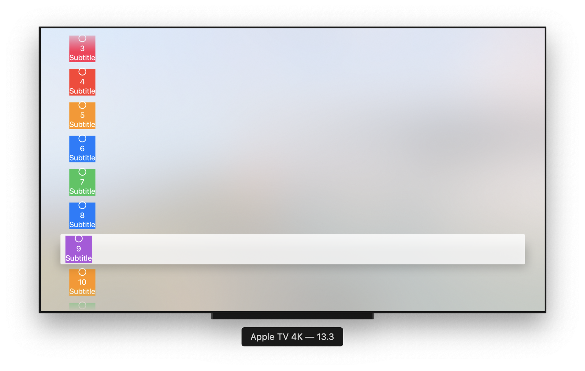

# Basic-Apple-TV-Examples
Basic examples for Apple TV UIKit and SwiftUI 


## Reference


https://developer.apple.com/tutorials/swiftui/composing-complex-interfaces

SwiftUI On All Devices


https://developer.apple.com/videos/play/wwdc2019/240/


```
struct ContentView: View {
    let items: [String] = (0...50).map { String($0) }
    var body: some View {
        List() {
            ForEach(self.items, id: \.self) { row in
                    Button(action: { }, label: {
                           Image(systemName: "circle")
                           Text(row)
                           Text("Subtitle")
                       })
                       .foregroundColor(Color.white)
                       .background(Color.random)
            }
        }
    }
```


**Example:** 




## Examples UIkit

* **Alerts** 
* **Buttons**
* **CollectionView**
* **FocusView**
* **PresentController**
* **TextField**


## Examples  SwiftUI

* **Alerts** 
* **Buttons**
* **FocusView**
* **List**
* **PresentController**
* **TextField**

